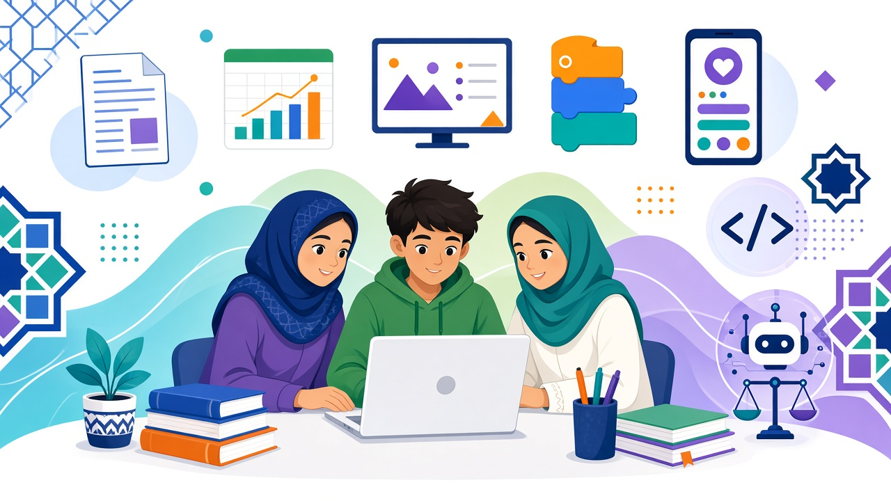
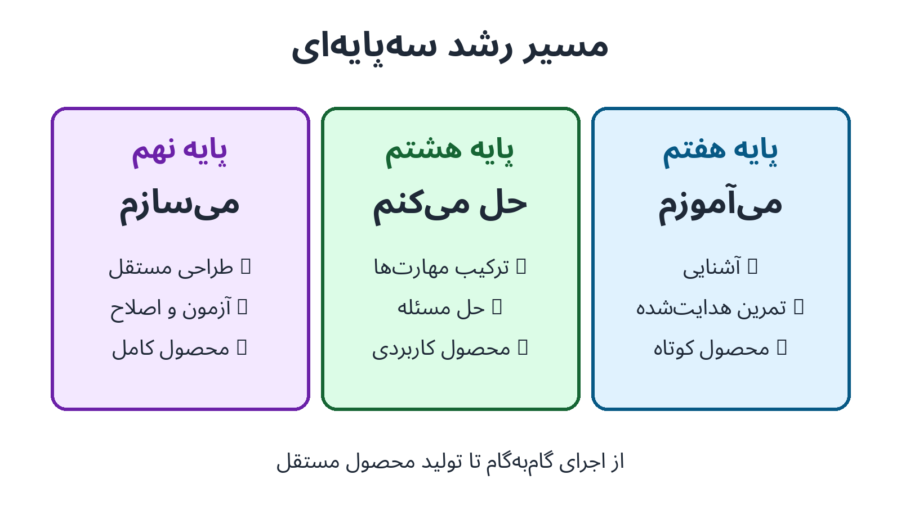
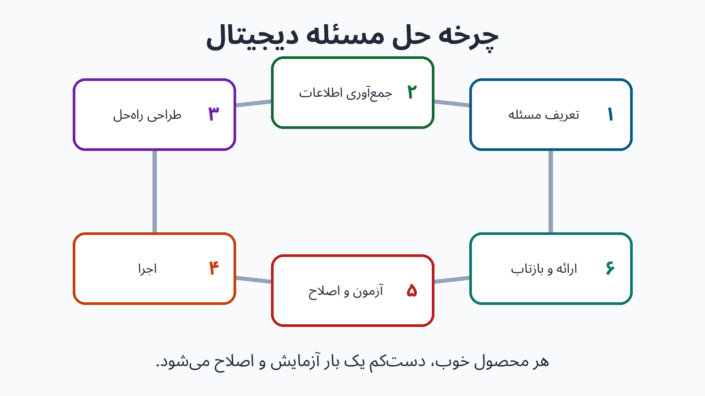
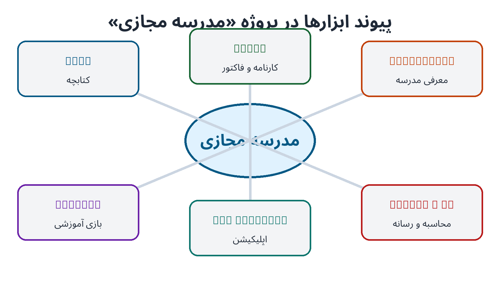

# طرح تفصیلی مجموعه آموزش مهارت‌های کامپیوتری

## ویژه دانش‌آموزان پایه‌های هفتم، هشتم و نهم

**نسخه ۱.۰ — سال تحصیلی ۱۴۰۵–۱۴۰۶**

> این سند، نقشه راه تولید مجموعه است؛ یعنی پیش از نگارش جزوه‌های Word، Excel، PowerPoint، Scratch، MIT App Inventor، Python و هوش مصنوعی، ساختار آموزشی، سطح‌بندی، پروژه‌ها، شیوه ارزشیابی و زبان بصری همه جلدها را یکپارچه می‌کند.

---

# ۱. هویت و فلسفه مجموعه

این مجموعه برای دانش‌آموزان دوره اول متوسطه طراحی می‌شود و از «کار با ابزار» فراتر می‌رود. دانش‌آموز باید بتواند مسئله‌ای واقعی را تشخیص دهد، ابزار مناسب را انتخاب کند، محصول دیجیتال بسازد، آن را آزمایش و اصلاح کند و درباره تصمیم‌های خود توضیح دهد.

## مسیر رشد سه‌پایه‌ای

| پایه | شعار آموزشی | نقش دانش‌آموز | سطح استقلال | محصول مورد انتظار |
|---|---|---|---|---|
| هفتم | آشنایی و کسب مهارت پایه | یادگیرنده و کاوشگر | اجرای فعالیت‌های هدایت‌شده | محصول کوتاه، درست و منظم |
| هشتم | حل مسئله و توسعه مهارت | سازنده و حل‌کننده مسئله | انتخاب و ترکیب آموخته‌ها | محصول کاربردی و قابل آزمایش |
| نهم | تولید محصول و پروژه مستقل | طراح و تولیدکننده | برنامه‌ریزی، اجرا و بازبینی مستقل | محصول کامل، مستند و قابل ارائه |

## اصول آموزشی

- یادگیری پروژه‌محور و مبتنی بر مسئله‌های مدرسه و زندگی روزمره
- حرکت تدریجی از «مشاهده و تقلید» به «انتخاب، ساخت و دفاع از محصول»
- آموزش مفهوم‌های پایدار به‌جای حفظ مسیر منوهای یک نسخه خاص
- تمرین فردی، دونفره و گروهی با نقش‌های روشن
- توجه هم‌زمان به مهارت فنی، خلاقیت، ارتباط، اخلاق و ایمنی دیجیتال
- پیش‌بینی فعالیت جایگزین برای اینترنت ضعیف یا تعداد محدود رایانه
- استفاده از داده‌های ساختگی یا ناشناس در همه تمرین‌ها
- امکان استفاده از نرم‌افزارهای رایگان، نسخه‌های تحت وب یا جایگزین‌های آزاد

---

# ۲. اهداف کلان و شایستگی‌ها

دانش‌آموز در پایان مجموعه می‌تواند:

۱. فایل‌ها و پوشه‌های خود را با نام‌گذاری درست، نسخه‌بندی و پشتیبان‌گیری مدیریت کند.  
۲. سند، صفحه‌گسترده، ارائه و محتوای دیداری متناسب با هدف و مخاطب بسازد.  
۳. داده را وارد، مرتب، محاسبه، تحلیل و با نمودار مناسب نمایش دهد.  
۴. یک مسئله را به بخش‌های کوچک تقسیم و برای آن الگوریتم طراحی کند.  
۵. با برنامه‌نویسی بلوکی و متنی، برنامه یا بازی قابل اجرا تولید کند.  
۶. محصول دیجیتال را طراحی، آزمایش، خطایابی، اصلاح و مستند کند.  
۷. در گروه نقش بپذیرد، بازخورد سازنده بدهد و محصول را ارائه کند.  
۸. اعتبار اطلاعات و خروجی ابزارهای هوش مصنوعی را بررسی کند.  
۹. حریم خصوصی، امنیت حساب، مالکیت فکری و احترام آنلاین را رعایت کند.  
۱۰. ارتباط میان ابزارها را در ساخت یک محصول جامع تشخیص دهد.

## حوزه‌های شایستگی

- سواد اطلاعات و داده
- تولید محتوای دیجیتال
- تفکر محاسباتی و برنامه‌نویسی
- ارتباط، همکاری و ارائه
- حل مسئله و طراحی محصول
- امنیت، سلامت و مسئولیت‌پذیری دیجیتال
- خودارزیابی، مستندسازی و بهبود مستمر

---

# ۳. معماری مجموعه

## جلدهای اصلی

| شماره | عنوان جلد | محصول محوری |
|---:|---|---|
| ۱ | Microsoft Word | بخشی حرفه‌ای از یک کتاب درسی |
| ۲ | Microsoft Excel | فاکتور فروش و کارنامه دانش‌آموز |
| ۳ | Microsoft PowerPoint | ارائه کامل درباره یک درس عمومی |
| ۴ | Scratch | مجموعه بازی‌های ساده تا بازی کامل چندمرحله‌ای |
| ۵ | MIT App Inventor | اپلیکیشن کاربردی و بازی موبایلی |
| ۶ | Python مقدماتی | برنامه‌های کاربردی و بازی‌های متنی |
| ۷ | هوش مصنوعی | محتوای چندرسانه‌ای و انیمیشن مسئولانه |
| ۸ | پروژه جامع نهم | مدرسه مجازی کوچک |

## اجزای هر جلد

- کتاب دانش‌آموز
- راهنمای مدرس
- دفتر پروژه و پوشه کار
- فایل‌های آغازین و داده‌های نمونه
- چک‌لیست‌ها و روبریک‌های قابل چاپ
- پاسخ تمرین‌های منتخب
- واژه‌نامه فارسی و معادل رایج انگلیسی
- فعالیت جایگزین بدون اینترنت
- نسخه کم‌حجم مناسب چاپ سیاه‌وسفید

---

# ۴. الگوی ثابت هر فصل و درس

## ساختار هر فصل

۱. **مسئله آغازین:** یک موقعیت واقعی از مدرسه، خانه یا جامعه  
۲. **نقشه یادگیری:** هدف‌ها، پیش‌نیازها و محصول فصل  
۳. **واژگان کلیدی:** اصطلاح فارسی، انگلیسی و تعریف کوتاه  
۴. **درس‌های مرحله‌ای:** هر درس بر یک مهارت قابل مشاهده متمرکز است  
۵. **تمرین هدایت‌شده:** همراه نمونه و راهنمای گام‌به‌گام  
۶. **چالش انتخابی:** در سه سطح پایه، استاندارد و پیشرفته  
۷. **ایمنی و اخلاق دیجیتال:** یک تصمیم واقعی برای گفت‌وگو  
۸. **پروژه فصل:** محصولی که چند مهارت را یکپارچه می‌کند  
۹. **چک‌لیست کیفیت:** کنترل محصول پیش از تحویل  
۱۰. **خودارزیابی و بازخورد همتا**  
۱۱. **آزمون عملکردی کوتاه**  
۱۲. **فعالیت توسعه‌ای و فعالیت بدون اینترنت**

## ساختار هر درس

- عنوان، تصویر محوری و پرسش محرک
- «در این درس یاد می‌گیریم» با ۲ تا ۴ هدف قابل سنجش
- مرور کوتاه پیش‌نیاز
- آموزش تصویری در گام‌های شماره‌دار
- «انجام بده» برای تمرین اصلی
- «فکر کن» برای توضیح چرایی
- «رفع اشکال» برای خطاهای رایج
- «یک گام بیشتر» برای دانش‌آموز آماده‌تر
- ثبت شاهد یادگیری در پوشه کار

## زبان آموزشی

- جمله‌های کوتاه، فعال و مستقیم باشند.
- هر گام فقط یک عمل اصلی داشته باشد.
- نام فرمان‌های نرم‌افزار به‌صورت فارسی و معادل انگلیسی نوشته شود.
- از مثال‌های واقعی، فرهنگی و قابل فهم برای نوجوان ایرانی استفاده شود.
- پاسخ آماده جای فرایند فکرکردن را نگیرد.

---

# ۵. نقشه پیشرفت Microsoft Word

## پایه هفتم: آشنایی و مهارت پایه

**هدف:** ساخت یک سند خوانا، منظم و قابل چاپ.

**سرفصل‌ها:** محیط Word، ایجاد و ذخیره سند، تایپ فارسی و انگلیسی، انتخاب و قالب‌بندی متن، پاراگراف‌بندی، فهرست، درج تصویر، جدول، حاشیه صفحه و صفحه‌آرایی ساده.

**تمرین‌های کلیدی:**

- ساخت پوشه و ذخیره فایل با نام معنادار
- اصلاح فاصله، نیم‌فاصله و جهت متن
- تنظیم قلم، اندازه، رنگ و ترازبندی
- درج تصویر همراه زیرنویس
- ساخت جدول برنامه هفتگی

**پروژه:** بازسازی یک صفحه از کتاب درسی شامل عنوان، متن، تصویر، جدول و شماره صفحه.

**خروجی قابل سنجش:** سند ۲ صفحه‌ای بدون خطای آشکار نگارشی، با ساختار منظم و نسخه PDF.

## پایه هشتم: حل مسئله و توسعه مهارت

**هدف:** سازمان‌دهی یک سند چندصفحه‌ای با ساختار حرفه‌ای.

**سرفصل‌ها:** Styles، Heading، فهرست مطالب خودکار، Header و Footer، شماره صفحه، جدول‌های حرفه‌ای، Shapes، تنظیم تصویر، Page Break و Page Layout.

**تمرین‌های کلیدی:**

- تعریف سبک یکپارچه برای عنوان‌ها
- ساخت فهرست مطالب و به‌روزرسانی آن
- طراحی سربرگ و پابرگ
- ترکیب جدول، تصویر و Shape بدون به‌هم‌ریختگی صفحه
- بازبینی سند با نظر همکلاسی

**پروژه:** طراحی چند صفحه از یک کتاب درسی با فهرست، تیترها، تصاویر و جدول‌های هماهنگ.

**خروجی قابل سنجش:** سند ۴ تا ۶ صفحه‌ای با فهرست خودکار، Header/Footer و قالب یکپارچه.

## پایه نهم: تولید محصول مستقل

**هدف:** طراحی، تولید، بازبینی و انتشار بخشی کامل از یک کتاب درسی.

**پروژه اصلی:** طراحی یک بخش کامل از کتاب شامل جلد یا صفحه عنوان، تیترها، متن، تصاویر، جدول، شماره صفحات، Header/Footer، فهرست مطالب و صفحه‌آرایی حرفه‌ای.

**فرایند:** تحلیل نمونه ← طراحی الگو ← گردآوری محتوا ← ساخت نسخه اولیه ← بازخورد ← اصلاح ← کنترل چاپ ← خروجی PDF.

**خروجی قابل سنجش:** سند ۶ تا ۱۰ صفحه‌ای با سبک‌های استاندارد، منابع تصاویر، دسترس‌پذیری پایه و فایل نهایی قابل چاپ.

---

# ۶. نقشه پیشرفت Microsoft Excel

## پایه هفتم: آشنایی و مهارت پایه

**هدف:** ورود منظم داده و انجام محاسبات ابتدایی.

**سرفصل‌ها:** Workbook و Worksheet، سلول، سطر و ستون، نوع داده، قالب‌بندی جدول، چهار عمل اصلی، فرمول‌های ابتدایی و SUM.

**پروژه‌ها:** فاکتور فروش ساده و کارنامه ساده.

**خروجی قابل سنجش:** دو کاربرگ با ورودی‌های مشخص، فرمول درست و قالب‌بندی خوانا.

## پایه هشتم: حل مسئله و توسعه مهارت

**هدف:** محاسبه، تحلیل و نمایش داده برای تصمیم‌گیری.

**سرفصل‌ها:** SUM، AVERAGE، MAX، MIN، درصد، Sort، Filter، Conditional Formatting و Chart.

**پروژه‌ها:** فاکتور فروش محاسباتی و کارنامه با معدل، بیشترین و کمترین نمره و نمودار.

**خروجی قابل سنجش:** فایل دارای فرمول‌های قابل بررسی، نمودار عنوان‌دار و نتیجه‌گیری کوتاه.

## پایه نهم: تولید محصول مستقل

**هدف:** ساخت یک ابزار کامل و قابل استفاده.

**پروژه اصلی:** سیستم فاکتور فروش + کارنامه کامل.

**اجزای الزامی:** محاسبات خودکار، تخفیف، مالیات، جمع کل، محاسبه معدل، وضعیت قبولی، نمودار و قالب‌بندی حرفه‌ای.

**خروجی قابل سنجش:** فایل آزمایش‌شده با داده نمونه، کنترل خطاهای ورودی، راهنمای کوتاه کاربر و چاپ صحیح.

---

# ۷. نقشه پیشرفت Microsoft PowerPoint

## پایه هفتم: آشنایی و مهارت پایه

**هدف:** ساخت و اجرای یک ارائه کوتاه و روشن.

**سرفصل‌ها:** ساخت اسلاید، متن، تصویر، Layout، طراحی، Transition، Animation و Slide Show.

**پروژه:** ارائه ۵ تا ۷ اسلایدی درباره یکی از درس‌های عمومی.

**خروجی قابل سنجش:** آغاز، بدنه و پایان مشخص؛ متن کم‌حجم؛ تصاویر مرتبط؛ اجرای روان.

## پایه هشتم: حل مسئله و توسعه مهارت

**هدف:** روایت دیداری یک موضوع با استفاده از شواهد.

**سرفصل‌ها:** اصول طراحی، Theme، Layout، نمودار، جدول، تصاویر، Animation هدفمند، Audio و Video.

**پروژه:** ارائه کامل یک درس عمومی در ۸ تا ۱۰ اسلاید.

**خروجی قابل سنجش:** ساختار منطقی، طراحی هماهنگ، نمودار یا جدول، رسانه معتبر و ذکر منابع.

## پایه نهم: تولید محصول مستقل

**هدف:** پژوهش، طراحی و ارائه شفاهی یک موضوع درسی.

**پروژه اصلی:** ارائه کامل شامل تحقیق، ساختار ارائه، طراحی اسلاید، تصویر، نمودار، انیمیشن، ویدئو و ارائه شفاهی.

**خروجی قابل سنجش:** فایل ارائه، یادداشت سخنران، فهرست منابع، اجرای زمان‌بندی‌شده و پاسخ به پرسش مخاطب.

---

# ۸. نقشه پیشرفت Scratch

## پایه هفتم: آشنایی و مهارت پایه

**هدف:** درک توالی، رویداد و تعامل ساده.

**سرفصل‌ها:** محیط Scratch، Sprite، Stage، حرکت، صدا، رویداد، شرط ساده و متغیر.

**پروژه‌ها:** داستان تعاملی، بازی دنبال‌کردن و بازی پرسش کوتاه.

**خروجی قابل سنجش:** پروژه دارای دست‌کم دو شخصیت، سه رویداد، یک شرط و یک متغیر.

## پایه هشتم: حل مسئله و توسعه مهارت

**هدف:** ساخت بازی با قانون، بازخورد و چند مرحله.

**سرفصل‌ها:** شرط‌ها، حلقه‌ها، متغیرها، امتیاز، جان، Broadcast، برخورد و مرحله‌بندی.

**پروژه:** بازی چندمرحله‌ای آموزشی.

**خروجی قابل سنجش:** صفحه راهنما، امتیاز و جان، دست‌کم دو مرحله و شرایط پایان روشن.

## پایه نهم: تولید محصول مستقل

**هدف:** طراحی یک بازی کامل برای مخاطب واقعی.

**پروژه اصلی:** بازی شامل منوی شروع، چند مرحله، امتیاز، جان، صدا، برد و باخت و افزایش سختی.

**خروجی قابل سنجش:** فایل بازی، راهنمای کاربر، جدول آزمون با حداقل دو کاربر و گزارش اصلاحات.

---

# ۹. نقشه پیشرفت MIT App Inventor

## پایه هفتم: آشنایی و مهارت پایه

**هدف:** شناخت طراحی رابط و برنامه‌نویسی رویدادمحور.

**سرفصل‌ها:** Designer، Screen، Button، Label، Image، TextBox و Blocks.

**پروژه:** اپلیکیشن معرفی یا آزمون ساده با ورودی و بازخورد.

**خروجی قابل سنجش:** رابط منظم، دکمه فعال، ورودی کنترل‌شده و پیام نتیجه.

## پایه هشتم: حل مسئله و توسعه مهارت

**هدف:** ساخت اپلیکیشن کاربردی و بازی موبایلی.

**سرفصل‌ها:** چند Screen، Layout، متغیر، شرط، رویداد، List، صدا و TinyDB.

**پروژه‌ها:** برنامه‌ریز تکالیف یا دفترچه اطلاعات + بازی موبایلی کوتاه.

**خروجی قابل سنجش:** ثبت و بازیابی اطلاعات، ناوبری روشن و آزمایش روی دستگاه یا شبیه‌ساز.

## پایه نهم: تولید محصول مستقل

**هدف:** تبدیل یک نیاز واقعی به اپلیکیشن قابل استفاده.

**پروژه اصلی:** یکی از گزینه‌های برنامه آموزشی، ماشین حساب، آزمون، دفترچه اطلاعات یا بازی موبایلی.

**خروجی قابل سنجش:** فایل پروژه، فایل نصب در صورت امکان، راهنمای کاربر، سناریوی آزمون و گزارش بازخورد.

---

# ۱۰. نقشه پیشرفت Python مقدماتی

## پایه هفتم: آشنایی و مهارت پایه

**هدف:** درک اجرای دستور و تعامل ورودی/خروجی.

**سرفصل‌ها:** Python چیست، اجرای اولین برنامه، `print`، متغیر، `input`، اعداد، رشته‌ها و خطاهای ساده.

**پروژه‌ها:** سلام شخصی، تبدیل واحد، محاسبه سن و بازی کوچک پرسش و پاسخ.

**خروجی قابل سنجش:** برنامه‌ای با ورودی، محاسبه و خروجی واضح که دانش‌آموز بتواند هر خط آن را توضیح دهد.

## پایه هشتم: حل مسئله و توسعه مهارت

**هدف:** حل مسئله با انتخاب، تکرار و تقسیم برنامه به بخش‌ها.

**سرفصل‌ها:** `if / elif / else`، حلقه `for`، حلقه `while`، List و تابع ساده.

**پروژه‌ها:** ماشین حساب، آزمون، بازی حدس عدد و مسابقه سؤال و جواب.

**خروجی قابل سنجش:** برنامه دارای شرط، تکرار، تابع و مدیریت ورودی نامعتبر.

## پایه نهم: تولید محصول مستقل

**هدف:** ساخت برنامه ساخت‌یافته، قابل آزمایش و مستند.

**پروژه اصلی:** مجموعه‌ای شامل ماشین حساب، مدیریت نمرات، بازی حدس عدد، بازی سؤال و جواب و برنامه مدیریت اطلاعات ساده.

**خروجی قابل سنجش:** کد بخش‌بندی‌شده، نام‌گذاری روشن، داده نمونه، مدیریت خطا، راهنمای اجرا و گزارش آزمون.

---

# ۱۱. نقشه پیشرفت هوش مصنوعی

## پایه هفتم: آشنایی و مهارت پایه

**هدف:** شناخت AI، کاربردها، محدودیت‌ها و درخواست‌نویسی ساده.

**سرفصل‌ها:** AI چیست، کاربردهای روزمره، Chatbot، اجزای یک درخواست مناسب، تولید متن و تصویر، آشنایی با ساخت انیمیشن.

**پروژه:** ایجاد محتوای تصویری یا انیمیشن کوتاه با ثبت ایده، درخواست و اصلاحات انسانی.

**خروجی قابل سنجش:** محصول کوتاه همراه برگه «چه چیزی را AI ساخت و من چه چیزی را تغییر دادم؟».

## پایه هشتم: حل مسئله و توسعه مهارت

**هدف:** استفاده هدفمند، مرحله‌ای و نقادانه از AI.

**سرفصل‌ها:** Prompt بهتر، تولید متن، تصویر، صدا و ویدئو، راستی‌آزمایی و استفاده از AI در Word، Excel و PowerPoint.

**پروژه:** ساخت محتوای چندرسانه‌ای با متن، تصویر و صدا.

**خروجی قابل سنجش:** زنجیره درخواست‌ها، خروجی ویرایش‌شده، منابع بررسی و گزارش خطاها یا سوگیری‌های مشاهده‌شده.

## پایه نهم: تولید محصول مستقل

**هدف:** طراحی یک فرایند تولید مسئولانه با نظارت انسانی.

**پروژه اصلی:** ساخت انیمیشن با مسیر «ایده ← داستان ← شخصیت‌ها ← تصاویر ← صدا ← حرکت/ویدئو ← تدوین ← محصول نهایی».

**خروجی قابل سنجش:** انیمیشن نهایی، استوری‌بورد، فهرست ابزارها و منابع، اعلام استفاده از AI و تحلیل محدودیت‌ها.

> هوش مصنوعی جایگزین یادگیری یا قضاوت دانش‌آموز نیست. دانش‌آموز باید بتواند خروجی را بررسی، اصلاح و از تصمیم‌های خود دفاع کند.

---

# ۱۲. توزیع پیشنهادی واحدهای آموزشی

هر واحد یک چرخه کامل «هدف، تمرین، تولید شاهد و بازخورد» است و می‌تواند بر اساس امکانات مدرسه کوتاه یا گسترده شود.

| حوزه | هفتم | هشتم | نهم | جمع |
|---|---:|---:|---:|---:|
| سواد پایه، مدیریت فایل و ایمنی | ۴ | ۲ | ۲ | ۸ |
| Word | ۵ | ۵ | ۴ | ۱۴ |
| Excel | ۶ | ۷ | ۷ | ۲۰ |
| PowerPoint | ۴ | ۵ | ۵ | ۱۴ |
| Scratch | ۸ | ۸ | ۶ | ۲۲ |
| MIT App Inventor | ۵ | ۷ | ۸ | ۲۰ |
| Python | ۶ | ۸ | ۱۰ | ۲۴ |
| هوش مصنوعی | ۴ | ۵ | ۶ | ۱۵ |
| پروژه جامع و ارائه | ۴ | ۵ | ۸ | ۱۷ |
| **جمع پیشنهادی** | **۴۶** | **۵۲** | **۵۶** | **۱۵۴** |

مدرسه می‌تواند با توجه به امکانات، یکی از مسیرهای Scratch یا App Inventor را کوتاه‌تر کند؛ اما حذف کامل برنامه‌نویسی بلوکی پیش از Python توصیه نمی‌شود.

---

# ۱۳. نظام ارزشیابی

## ارزشیابی تشخیصی

- پرسش‌نامه تجربه و دسترسی دیجیتال
- فعالیت عملی مدیریت فایل و تایپ
- مسئله کوتاه برای سنجش تفکر الگوریتمی
- بررسی نمونه‌کار قبلی بدون اثر مستقیم بر نمره

## ارزشیابی تکوینی

- مشاهده عملکرد با چک‌لیست
- پرسش خروج از کلاس
- پوشه کار دیجیتال
- خودارزیابی و بازخورد همتا
- نمایش نسخه اولیه و ثبت اصلاحات
- گزارش خطا: «چه شد، چرا شد و چگونه اصلاح شد؟»

## ارزشیابی پایانی

- محصول قابل اجرا یا انتشار
- ارائه یا نمایش عملی محصول
- مستندات فرایند طراحی و آزمون
- پاسخ به پرسش‌های فنی و اخلاقی
- بازنگری محصول پس از دریافت بازخورد

## ترکیب پیشنهادی امتیاز

| مؤلفه | سهم |
|---|---:|
| تمرین‌ها و شواهد تکوینی | ۲۵٪ |
| پروژه‌های فصل | ۳۰٪ |
| پوشه کار و مستندسازی | ۱۵٪ |
| پروژه جامع | ۲۰٪ |
| ارائه، خودارزیابی و همکاری | ۱۰٪ |

## روبریک مشترک پروژه‌ها

| معیار | ۴ — پیشرفته | ۳ — مطلوب | ۲ — در حال رشد | ۱ — نیازمند حمایت |
|---|---|---|---|---|
| تحقق هدف | همه نیازها و یک بهبود معنادار اجرا شده | همه نیازهای اصلی اجرا شده | بخشی از نیازها اجرا شده | محصول ناقص یا نامرتبط است |
| صحت فنی | بدون خطای مؤثر و دارای مدیریت خطا | خطاهای جزئی دارد | خطا مانع بخشی از کار است | محصول اجرا نمی‌شود |
| طراحی و کاربردپذیری | منسجم، خوانا و آزموده با کاربر | قابل فهم و استفاده | ناهماهنگی یا ابهام دارد | استفاده از آن دشوار است |
| حل مسئله | تصمیم‌ها تحلیل و مستند شده‌اند | مسیر حل منطقی است | با راهنمایی زیاد انجام شده | مسیر حل مشخص نیست |
| خلاقیت | انتخاب‌ها هدفمند و اصیل‌اند | محصول شخصی‌سازی شده | تغییرات محدود دارد | فقط نمونه را تکرار کرده |
| مستندسازی | فرایند، منابع، آزمون و اصلاحات کامل‌اند | مراحل و منابع اصلی ثبت شده‌اند | مستندات ناقص است | مستندات ارائه نشده |
| مسئولیت دیجیتال | حریم خصوصی، منابع و AI شفاف است | اصول اصلی رعایت شده | یک یا دو کاستی دارد | خطر یا تخلف آشکار دارد |
| همکاری و ارائه | نقش‌ها روشن و دفاع مستدل است | همکاری و ارائه مناسب است | مشارکت نامتوازن است | همکاری یا ارائه مؤثر نیست |

---

# ۱۴. پروژه نهایی پایه نهم: مدرسه مجازی کوچک

## هدف پروژه

دانش‌آموزان نشان می‌دهند مهارت‌های دیجیتال جدا از هم نیستند و می‌توانند برای ساخت یک محصول واقعی کنار یکدیگر قرار گیرند.

| ابزار | محصول |
|---|---|
| Word | کتابچه آموزشی و راهنمای مدرسه |
| Excel | کارنامه، فاکتور و داشبورد ساده |
| PowerPoint | ارائه و معرفی مدرسه |
| Scratch | بازی آموزشی |
| App Inventor | اپلیکیشن مدرسه |
| Python | برنامه محاسبه معدل یا مدیریت اطلاعات |
| AI | پوستر و انیمیشن معرفی با ثبت فرایند استفاده |

## مراحل اجرا

نیازسنجی ← تعریف مسئله ← طراحی کاغذی ← تقسیم نقش ← نمونه اولیه ← آزمون ← اصلاح ← مستندسازی ← ارائه.

## نقش‌های پیشنهادی

مدیر پروژه، طراح محتوا، تحلیلگر داده، برنامه‌نویس، طراح رابط، آزمون‌گر و مسئول مستندسازی. در گروه کوچک، هر دانش‌آموز می‌تواند چند نقش داشته باشد.

## شواهد الزامی

- صورت مسئله و معیارهای موفقیت
- طرح اولیه و تقسیم وظایف
- نسخه‌های مختلف محصول
- جدول خطاها و اصلاحات
- منابع متن، داده و تصاویر
- برگه اعلام موارد استفاده از هوش مصنوعی
- بازخورد حداقل دو کاربر
- خودارزیابی فردی و گروهی

---

# ۱۵. ایمنی دیجیتال و هوش مصنوعی مسئولانه

## قواعد ایمنی دیجیتال

۱. اطلاعات شخصی، نشانی، شماره تماس، گذرواژه و تصویر خصوصی در پروژه عمومی قرار نگیرد.  
۲. برای تمرین از نام و داده ساختگی استفاده شود.  
۳. پیوند، فایل یا پیام ناشناس بدون بررسی باز نشود.  
۴. مزاحمت، جعل هویت یا درخواست مشکوک به بزرگسال مورد اعتماد گزارش شود.  
۵. منبع و مجوز متن، تصویر، صدا و ویدئو ثبت شود.  
۶. پیش از انتشار، اطلاعات ناخواسته و کیفیت فایل کنترل شود.  
۷. نسخه پشتیبان و نام‌گذاری نسخه‌ها جدی گرفته شود.  
۸. نصب نرم‌افزار یا تغییر تنظیمات اصلی فقط با اجازه مدرس انجام شود.

## قواعد استفاده مسئولانه از AI

- داده شخصی یا محرمانه وارد ابزار نشود.
- ادعاهای مهم با کتاب یا منبع مستقل بررسی شوند.
- خروجی از نظر خطا، سوگیری و تناسب فرهنگی بازبینی شود.
- تحویل مستقیم خروجی AI به‌عنوان کار شخصی پذیرفته نیست.
- نام ابزار، هدف استفاده، درخواست اصلی و اصلاحات دانش‌آموز ثبت شود.
- برای تصمیم‌های حساس آموزشی، سلامت یا امنیتی به خروجی خودکار اتکا نشود.
- مدرس برای فعالیت‌های وابسته به AI، جایگزین بدون AI پیش‌بینی کند.

---

# ۱۶. نظام طراحی بصری جزوه

## رنگ پایه‌ها

| پایه | رنگ اصلی | زمینه روشن | نماد | مفهوم |
|---|---|---|---|---|
| هفتم | آبی `#075985` | `#E0F2FE` | قطب‌نما | کشف و آشنایی |
| هشتم | سبز `#166534` | `#DCFCE7` | ابزار | تمرین و ساخت |
| نهم | بنفش `#6B21A8` | `#F3E8FF` | موشک | پروژه و استقلال |
| هشدار | نارنجی `#C2410C` | `#FFEDD5` | مثلث | ایمنی و خطا |

رنگ هرگز تنها نشانه نیست؛ نام پایه، شماره و نماد نیز همیشه نمایش داده می‌شود.

## تایپوگرافی و صفحه

- قلم پیشنهادی: Noto Sans Arabic یا Vazirmatn
- اندازه متن اصلی: ۱۱ تا ۱۲ پوینت
- اندازه عنوان درس: ۱۶ پوینت و عنوان فصل: ۲۰ پوینت
- صفحه A4 با حاشیه داخلی ۲۰ و بیرونی ۱۶ میلی‌متر
- متن راست‌چین و کد، مسیر فایل و فرمان‌ها چپ‌چین
- فاصله خطوط حدود ۱٫۴ و فضای سفید کافی
- Header شامل عنوان مجموعه، پایه و نام درس
- Footer شامل شماره صفحه، نسخه سند و نام کوتاه فصل

## کادرهای آموزشی

| کادر | نشانه | کاربرد |
|---|---|---|
| هدف | سیبل | نتیجه‌های قابل سنجش درس |
| نکته | لامپ | تعریف، میان‌بر یا توصیه کوتاه |
| تمرین | مداد | فعالیت هدایت‌شده با خروجی مشخص |
| چالش | پازل | مسئله باز با بیش از یک راه‌حل |
| پروژه | پوشه | محصول، مراحل و معیار تحویل |
| ارزشیابی | تیک | چک‌لیست و سطح عملکرد |
| هشدار | مثلث | ایمنی، حریم خصوصی یا خطای مهم |

---

# ۱۷. برنامه تصاویر و اینفوگرافیک‌ها

## اینفوگرافیک‌های ثابت مجموعه

۱. **نقشه پیشرفت سه‌پایه‌ای:** هفتم «می‌آموزم» ← هشتم «حل می‌کنم» ← نهم «می‌سازم».  
۲. **چرخه حل مسئله دیجیتال:** تعریف ← اطلاعات ← طراحی ← اجرا ← آزمون و اصلاح ← ارائه.  
۳. **نقشه ارتباط ابزارها:** متن، داده، ارائه، بازی، اپ، برنامه و AI در پروژه مدرسه مجازی.  
۴. **درخت مدیریت فایل:** پوشه‌بندی، نام‌گذاری، نسخه و پشتیبان.  
۵. **سپر امنیت دیجیتال:** گذرواژه، حریم خصوصی، پیوند امن، به‌روزرسانی، منبع و گزارش.  
۶. **مسیر عیب‌یابی:** بازتولید مشکل، خواندن پیام خطا، بررسی ورودی، آزمون راه‌حل و درخواست کمک.

## استاندارد تصاویر آموزشی

- هر تصویر باید یک مفهوم یا مرحله را توضیح دهد؛ تصویر تزئینی محدود باشد.
- اسکرین‌شات رابط نرم‌افزار برش‌خورده، خوانا و دارای حداکثر پنج نشانه شماره‌دار باشد.
- اطلاعات حساب، اعلان‌ها و نام واقعی در تصویر دیده نشود.
- تنوع جنسیتی و فضای آموزشی متناسب با جامعه ایران رعایت شود.
- هر تصویر عنوان، توضیح کوتاه، متن جایگزین و منبع داشته باشد.
- نمودارها عنوان، برچسب، واحد و منبع داده داشته باشند.
- رنگ تنها حامل معنا نباشد و نسخه سیاه‌وسفید نیز خوانا بماند.
- تصویر تولیدشده با AI با بازبینی انسانی و اعلام روش تولید استفاده شود.

## الگوی توزیع تصویر در هر درس

- صفحه آغاز: یک تصویر محوری
- آموزش: یک تصویر یا اسکرین‌شات برای هر ۲ تا ۴ گام
- جمع‌بندی: یک اینفوگرافیک
- پروژه: نمونه خروجی و چک‌لیست تصویری

---

# ۱۸. راهنمای مدرس

- درس را با مسئله آغاز کند، نه معرفی منوها.
- نمونه نهایی و معیار موفقیت را در شروع نشان دهد.
- نمایش مدرس کوتاه و زمان تمرین دانش‌آموز بیشتر باشد.
- برای هر فعالیت سه سطح پایه، استاندارد و چالش فراهم کند.
- خطا را بخشی از یادگیری بداند و مسیر اصلاح را از دانش‌آموز بپرسد.
- گروه‌ها را با نقش و مسئولیت مشخص سازمان دهد.
- فرایند، نسخه‌های میانی و محصول نهایی را با هم ارزیابی کند.
- پیش از فعالیت آنلاین، نوع داده مجاز و قواعد حریم خصوصی را روشن کند.
- برای کمبود تجهیزات از کار دونفره، طراحی روی کاغذ و داده چاپی استفاده کند.
- نمونه‌ها را با زبان و موقعیت دانش‌آموزان ایرانی سازگار کند.

---

# ۱۹. راهنمای دانش‌آموز

۱. پیش از شروع، هدف و معیار موفقیت را بخوان.  
۲. پوشه و فایل‌ها را با نام مشخص ذخیره کن.  
۳. مسئله را به گام‌های کوچک تقسیم کن.  
۴. ابتدا نسخه ساده و قابل اجرا بساز.  
۵. پس از هر تغییر، محصول را آزمایش کن.  
۶. خطا و روش اصلاح را ثبت کن.  
۷. منبع متن، داده، تصویر و کمک AI را بنویس.  
۸. پیش از انتشار، اطلاعات شخصی و کیفیت محتوا را بررسی کن.  
۹. بازخورد بگیر و نسخه نهایی را با نسخه نخست مقایسه کن.  
۱۰. محصولی تحویل بده که بتوانی همه بخش‌هایش را توضیح دهی.

---

# ۲۰. برنامه تولید جلدها

## ترتیب تولید

۱. Word در سه سطح  
۲. Excel در سه سطح  
۳. PowerPoint در سه سطح  
۴. Scratch در سه سطح  
۵. MIT App Inventor در سه سطح  
۶. Python مقدماتی در سه سطح  
۷. هوش مصنوعی در سه سطح  
۸. پروژه جامع مدرسه مجازی

## فرایند تولید هر جلد

نیازسنجی ← تعیین شایستگی‌ها ← طراحی پروژه محوری ← نگارش فصل نمونه ← اجرای آزمایشی ← تحلیل بازخورد ← ویرایش آموزشی و زبانی ← بررسی دسترس‌پذیری و ایمنی ← تولید فایل‌های همراه ← انتشار نسخه.

## معیارهای کنترل کیفیت

- تناسب سطح دشواری با پایه
- صحت علمی، فنی و نگارشی
- پایداری مفهوم‌ها در برابر تغییر نسخه نرم‌افزار
- امکان اجرا با ابزار رایگان یا جایگزین آزاد
- قابلیت اجرا با اینترنت محدود
- شفافیت معیارهای ارزشیابی
- تنوع فرهنگی و جنسیتی مثال‌ها
- رعایت حریم خصوصی، مالکیت فکری و AI مسئولانه
- خوانایی نسخه رنگی و سیاه‌وسفید

---

# ۲۱. گام اجرایی بعدی

نخستین جلد اجرایی، **Microsoft Word** است و با همین قالب برای هر سه پایه نوشته می‌شود:

- مقدمه و اهداف
- درس‌های مرحله‌به‌مرحله
- تصاویر و اسکرین‌شات‌های شماره‌گذاری‌شده
- مثال و تمرین هدایت‌شده
- نکته، هشدار و رفع اشکال
- چالش‌های سه‌سطحی
- پروژه پایانی هر پایه
- چک‌لیست، روبریک و خودارزیابی
- فایل تمرین و نمونه خروجی

پس از اجرای آزمایشی فصل Word پایه هفتم و دریافت بازخورد، همان استاندارد برای پایه‌های هشتم و نهم و سپس جلدهای دیگر اعمال می‌شود.

