# Microsoft Word — پایه هفتم

## آموزش گام‌به‌گام واژه‌پردازی

**مجتمع آموزشی فرهنگی باقرالعلوم (ع)**  
**نویسنده: مهندس نقی زاده**  
**نسخه آزمایشی ۱.۰ — سال تحصیلی ۱۴۰۵–۱۴۰۶**

---

# راهنمای استفاده از جزوه

این جزوه نخستین جلد اجرایی از مجموعه آموزش ده مهارت کامپیوتری مجتمع آموزشی فرهنگی باقرالعلوم (ع) است. هدف آن حفظ‌کردن نام دکمه‌ها نیست؛ دانش‌آموز باید بتواند یک سند واقعی را از مرحله ایجاد فایل تا چاپ و خروجی PDF طراحی کند.

## مسیر ده‌مهارتی مجموعه

۱. Windows 11 و کار با سیستم‌عامل  
۲. Microsoft Word و تولید سند حرفه‌ای  
۳. Microsoft Excel و ساخت فاکتور و کارنامه  
۴. Microsoft PowerPoint و ارائه درسی  
۵. اینترنت، ابزارهای Google و فضای مجازی  
۶. Photoshop مقدماتی و طراحی کارت ویزیت  
۷. Scratch و ساخت بازی  
۸. MIT App Inventor و ساخت اپلیکیشن و بازی موبایلی  
۹. Python و ساخت برنامه و بازی  
۱۰. هوش مصنوعی، اصول پرامپت‌نویسی، کمک‌آموزشی و ساخت انیمیشن

## روش کار

- هر درس را به‌ترتیب بخوانید و هم‌زمان در Word اجرا کنید.
- در پایان هر گام، فایل را با `Ctrl+S` ذخیره کنید.
- تمرین هدایت‌شده را انجام دهید و شاهد آن را در پوشه کار قرار دهید.
- یکی از چالش‌های پایه، استاندارد یا پیشرفته را انتخاب کنید.
- خطاها را پاک نکنید؛ ابتدا دلیل و روش اصلاح آن‌ها را ثبت کنید.
- فرمان‌ها با نام فارسی و معادل انگلیسی نوشته شده‌اند.

> ممکن است جای بعضی فرمان‌ها در Word 2021 و Microsoft 365 کمی متفاوت باشد، اما نام و کاربرد اصلی آن‌ها یکسان است.

## نشانه‌های آموزشی

| نشانه | معنی |
|---|---|
| هدف | کاری که در پایان درس می‌توانید انجام دهید |
| تمرین | فعالیت گام‌به‌گام و الزامی |
| نکته | میان‌بر یا توضیحی برای کار بهتر |
| هشدار | خطایی که ممکن است باعث از بین رفتن یا به‌هم‌ریختگی کار شود |
| چالش | فعالیت انتخابی در سه سطح |
| پوشه کار | فایلی که توانایی شما را نشان می‌دهد |

---

# درس ۱: آشنایی با محیط Word

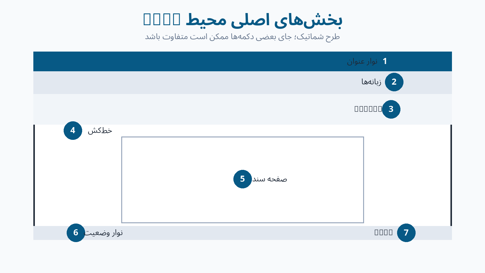

## هدف‌های یادگیری

در پایان این درس می‌توانید Word را اجرا کنید، یک سند خالی بسازید، هفت بخش محیط برنامه را نام ببرید و بزرگ‌نمایی را تغییر دهید.

## واژگان

| فارسی | English | کاربرد |
|---|---|---|
| واژه‌پرداز | Word Processor | ساخت و ویرایش سند متنی |
| سند | Document | فایل ساخته‌شده در Word |
| نوار عنوان | Title Bar | نمایش نام فایل و برنامه |
| نوار فرمان | Ribbon | محل زبانه‌ها و فرمان‌ها |
| زبانه | Tab | دسته‌ای از ابزارهای مرتبط |
| نوار وضعیت | Status Bar | اطلاعات صفحه، واژه و زبان |
| بزرگ‌نمایی | Zoom | تغییر اندازه نمایش روی صفحه |

## آموزش مرحله‌به‌مرحله

۱. منوی **شروع (Start)** را باز و `Word` را جست‌وجو کنید.  
۲. برنامه **Microsoft Word** را اجرا کنید.  
۳. گزینه **سند خالی (Blank document)** را انتخاب کنید.  
۴. **نوار عنوان (Title Bar)**، **نوار دسترسی سریع (Quick Access Toolbar)** و **نوار فرمان (Ribbon)** را پیدا کنید.  
۵. زبانه **خانه (Home)** را باز کنید و گروه‌های **قلم (Font)** و **پاراگراف (Paragraph)** را بیابید.  
۶. زبانه **درج (Insert)** را باز و فرمان‌های **Pictures** و **Table** را پیدا کنید.  
۷. در پایین پنجره، **Status Bar** و **Zoom Slider** را پیدا کنید.  
۸. بزرگ‌نمایی را روی ۸۰٪ و سپس ۱۰۰٪ قرار دهید.

## مثال

Word را مانند یک میز کار دیجیتال در نظر بگیرید: صفحه سفید محل نوشتن است و زبانه‌ها کشوهای ابزار هستند.

## تمرین هدایت‌شده

یک سند خالی بسازید. زبانه‌های Home، Insert، Layout و View را باز کنید و در هرکدام یک فرمان را پیدا کنید. در پایان Zoom را روی ۹۰٪ قرار دهید.

## نکته

اگر Ribbon دیده نمی‌شود، `Ctrl+F1` را فشار دهید یا روی یکی از زبانه‌ها دوبار کلیک کنید.

## هشدار

Zoom فقط اندازه نمایش را تغییر می‌دهد و اندازه واقعی نوشته در چاپ را عوض نمی‌کند.

## رفع اشکال

| مشکل | راه‌حل |
|---|---|
| Word پیدا نمی‌شود | در Start عبارت کامل Microsoft Word را جست‌وجو کنید |
| Ribbon پنهان است | `Ctrl+F1` را بزنید |
| صفحه بسیار کوچک است | Zoom را روی ۱۰۰٪ قرار دهید |
| یک الگو باز شده است | از File > New > Blank document استفاده کنید |

## چالش سه‌سطحی

- **پایه:** چهار بخش محیط Word را نام ببرید.
- **استاندارد:** محل پنج فرمانی را که مدرس نام می‌برد پیدا کنید.
- **پیشرفته:** فرمان Quick Print را به Quick Access Toolbar اضافه کنید.

**شاهد پوشه کار:** تصویر محیط Word با نام‌گذاری دست‌کم شش بخش.  
**پرسش خروج:** تفاوت Tab و Command چیست؟

---

# درس ۲: ایجاد، ذخیره و مدیریت فایل

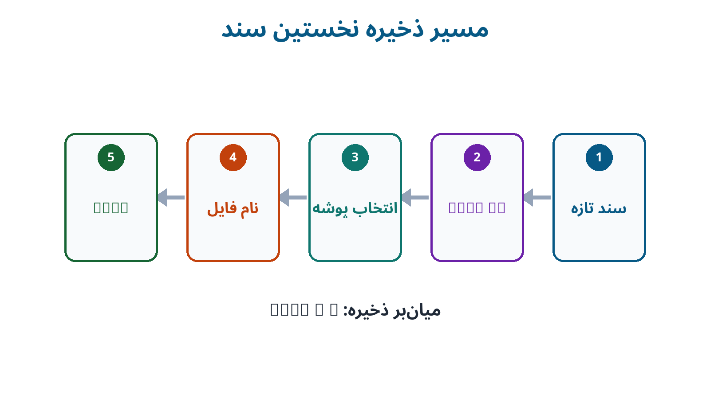

## هدف‌های یادگیری

در پایان این درس می‌توانید سند جدید بسازید، آن را در پوشه درست ذخیره کنید، دوباره باز کنید و تفاوت Save و Save As را توضیح دهید.

## واژگان

New، Open، Save، Save As، Browse، Folder، File Name و File Extension.

## آموزش مرحله‌به‌مرحله

۱. با **File > New > Blank document** سند جدید بسازید.  
۲. عبارت «گزارش فعالیت علمی» را تایپ کنید.  
۳. `Ctrl+S` را فشار دهید.  
۴. **Browse** را انتخاب و پوشه کلاس را باز کنید.  
۵. نام فایل را `درس02-مدیریت‌فایل-نام‌خانوادگی` بنویسید.  
۶. نوع فایل را **Word Document (*.docx)** نگه دارید و **Save** را بزنید.  
۷. یک جمله اضافه و دوباره `Ctrl+S` را اجرا کنید.  
۸. با **File > Save As** نسخه‌ای با نام `درس02-مدیریت‌فایل-نسخه2` بسازید.  
۹. Word را ببندید و فایل را از **File > Open > Browse** دوباره باز کنید.

## نام‌گذاری درست

نام `New Microsoft Word Document (3).docx` موضوع فایل را نشان نمی‌دهد؛ اما `درس02-گزارش-علی‌رضایی.docx` روشن و قابل جست‌وجو است.

## تمرین هدایت‌شده

پوشه `Word-7-نام‌خانوادگی` را بسازید و درون آن پوشه‌های `تمرین‌ها`، `تصاویر`، `پروژه نهایی` و `پشتیبان` را ایجاد کنید. یک سند را در تمرین‌ها ذخیره و نسخه دوم آن را در پشتیبان قرار دهید.

## میان‌برها

| عمل | میان‌بر |
|---|---|
| سند جدید | `Ctrl+N` |
| بازکردن | `Ctrl+O` |
| ذخیره | `Ctrl+S` |
| بستن سند | `Ctrl+W` |

## هشدار

هنگام تغییر نام فایل، پسوند `.docx` را حذف یا تغییر ندهید.

## رفع اشکال

- فایل پیدا نمی‌شود: محل ذخیره را در File Explorer بررسی کنید.
- تغییرات از بین رفته است: پس از هر بخش مهم `Ctrl+S` بزنید.
- فایل فقط خواندنی است: با Save As نسخه‌ای در پوشه شخصی بسازید.
- دو فایل شبیه هم هستند: تاریخ یا شماره نسخه را به نام اضافه کنید.

## چالش سه‌سطحی

- **پایه:** یک فایل با نام استاندارد ذخیره کنید.
- **استاندارد:** از یک سند دو نسخه شماره‌گذاری‌شده بسازید.
- **پیشرفته:** ساختار پوشه‌ای جدا برای تمرین، تصویر، PDF و پشتیبان طراحی کنید.

**شاهد پوشه کار:** تصویر پوشه‌ها و دو فایل دارای نام استاندارد.  
**پرسش خروج:** چه زمانی Save As را به‌جای Save به‌کار می‌بریم؟

---

# درس ۳: تایپ فارسی و انگلیسی

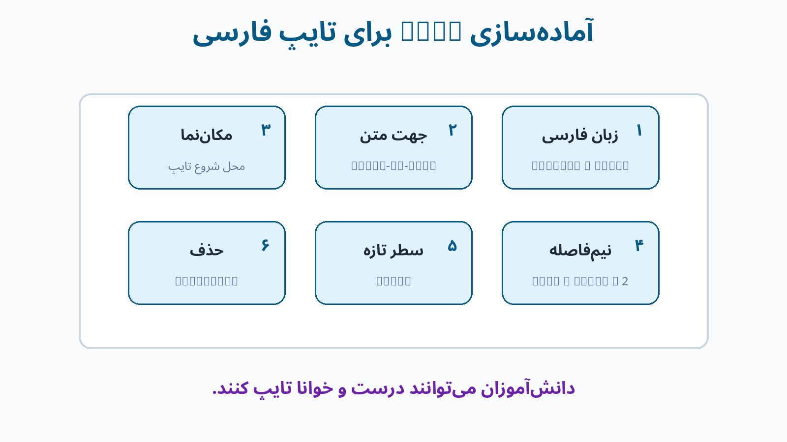

## هدف‌های یادگیری

می‌توانید زبان صفحه‌کلید و جهت متن را تغییر دهید، متن فارسی و انگلیسی بنویسید و نیم‌فاصله و نشانه‌گذاری را درست به‌کار ببرید.

## آموزش مرحله‌به‌مرحله

۱. با `Windows+Space` زبان فارسی یا انگلیسی را انتخاب کنید.  
۲. از **Home > Paragraph** جهت را روی **Right-to-Left Text Direction** قرار دهید.  
۳. بنویسید: «دانش‌آموزان پایه هفتم با نرم‌افزار Word کار می‌کنند.»  
۴. زبان را به English تغییر دهید و `Microsoft Word 2021` را تایپ کنید.  
۵. دوباره به فارسی بازگردید.  
۶. در «می‌روم»، «دانش‌آموز» و «نرم‌افزار» نیم‌فاصله قرار دهید.  
۷. میان‌بر رایج نیم‌فاصله `Ctrl+Shift+2` است؛ در بعضی چیدمان‌ها `Shift+Space` کار می‌کند.  
۸. اگر میان‌بر کار نکرد، از **Insert > Symbol > More Symbols** نویسه Unicode با کد `200C` را درج کنید.  
۹. پیش از نقطه و ویرگول فاصله نگذارید و پس از آن‌ها یک فاصله بگذارید.

## قبل و بعد

نادرست: `من می روم ،زیرا کلاس ها شروع شده اند .`  
درست: `من می‌روم، زیرا کلاس‌ها شروع شده‌اند.`

## تمرین هدایت‌شده

متن زیر را تایپ و اصلاح کنید:

«دانش آموزان می توانند فایل های خود را در Microsoft Word ذخیره کنند .این نرم افزار یک واژه پرداز است.»

## نکته

اگر بخش فارسی میان متن انگلیسی به‌هم ریخت، همان بخش را انتخاب و جهت Right-to-Left یا Left-to-Right را جداگانه اعمال کنید.

## هشدار

چند فاصله معمولی جای نیم‌فاصله نیست. نیم‌فاصله یک نویسه مستقل است.

## رفع اشکال

| مشکل | راه‌حل |
|---|---|
| حروف انگلیسی تایپ می‌شوند | زبان ورودی را با Windows+Space تغییر دهید |
| نقطه در ابتدای سطر دیده می‌شود | جهت پاراگراف را راست‌به‌چپ کنید |
| میان واژه‌ها فاصله بزرگ است | فاصله‌های اضافی را حذف کنید |
| نیم‌فاصله درج نمی‌شود | روش Unicode 200C را اجرا کنید |

## چالش سه‌سطحی

- **پایه:** پنج واژه دارای نیم‌فاصله بنویسید.
- **استاندارد:** یک بند پنج‌خطی با دو عبارت انگلیسی تایپ کنید.
- **پیشرفته:** متن دارای فاصله و جهت نادرست را بدون بازنویسی کامل اصلاح کنید.

**شاهد پوشه کار:** فایل شامل متن قبل و بعد از اصلاح.  
**پرسش خروج:** نیم‌فاصله در «می‌روم» چه تفاوتی با فاصله معمولی دارد؟

---

# درس ۴: انتخاب و ویرایش متن

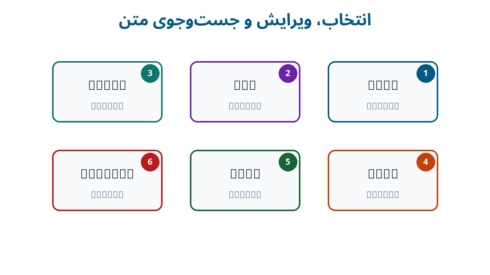

## هدف‌های یادگیری

می‌توانید متن را انتخاب، کپی، جابه‌جا یا حذف کنید، تغییر را بازگردانید و واژه‌ای را جست‌وجو یا جایگزین کنید.

## آموزش مرحله‌به‌مرحله

۱. برای انتخاب یک واژه روی آن دوبار و برای انتخاب بند سه‌بار کلیک کنید.  
۲. برای انتخاب همه سند `Ctrl+A` را بزنید.  
۳. متن انتخاب‌شده را با `Ctrl+C` کپی یا با `Ctrl+X` برش دهید.  
۴. مکان‌نما را در مقصد قرار دهید و `Ctrl+V` را بزنید.  
۵. اشتباه را با `Ctrl+Z` بازگردانید و با `Ctrl+Y` دوباره اجرا کنید.  
۶. با `Ctrl+F` واژه‌ای را جست‌وجو کنید.  
۷. با `Ctrl+H` پنجره Find and Replace را باز کنید.  
۸. واژه قبلی را در **Find what** و واژه تازه را در **Replace with** بنویسید.  
۹. ابتدا **Find Next** و **Replace** را اجرا کنید و فقط پس از بررسی از **Replace All** استفاده کنید.

## تمرین هدایت‌شده

یک بند چهارخطی بسازید؛ جمله دوم را به انتها منتقل کنید؛ واژه «مدرسه» را سه بار کپی کنید؛ یک تغییر را Undo و Redo کنید؛ سپس همه موارد «ورد» را با «Word» جایگزین کنید.

## نکته

برای چسباندن متن بدون قالب قبلی، از **Paste Options > Keep Text Only** استفاده کنید.

## هشدار

پیش از Replace All مطمئن شوید واژه موردنظر بخشی از واژه‌های دیگر نیست.

## رفع اشکال

- متن انتخاب‌شده پاک شد: `Ctrl+Z` بزنید.
- قالب ناخواسته منتقل شد: Keep Text Only را انتخاب کنید.
- Replace موارد اشتباه را تغییر داد: Undo کنید و جایگزینی را موردبه‌مورد انجام دهید.
- متن جابه‌جا نشد: پس از Cut مکان‌نما را در مقصد قرار دهید و Paste کنید.

## چالش سه‌سطحی

- **پایه:** سه جمله را به ترتیب درست مرتب کنید.
- **استاندارد:** متن به‌هم‌ریخته را با Cut، Copy و Paste اصلاح کنید.
- **پیشرفته:** با Find and Replace فاصله‌های دوتایی را حذف کنید.

**شاهد پوشه کار:** متن اولیه و متن ویرایش‌شده همراه توضیح سه تغییر.  
**پرسش خروج:** چرا Replace All همیشه بهترین انتخاب نیست؟

---

# درس ۵: قالب‌بندی متن

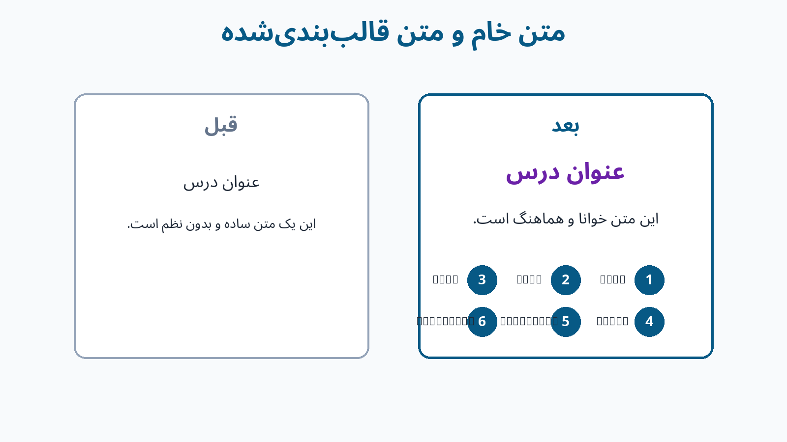

## هدف‌های یادگیری

می‌توانید قلم و اندازه را تغییر دهید، تأکید مناسب بسازید، رنگ را محدود و هدفمند به‌کار ببرید و قالب‌های شلوغ را پاک کنید.

## آموزش مرحله‌به‌مرحله

۱. متن را انتخاب کنید.  
۲. در **Home > Font** قلم و Font Size را تنظیم کنید.  
۳. عنوان را با **Bold** یا `Ctrl+B` ضخیم کنید.  
۴. در صورت نیاز از **Italic**، **Underline** و **Font Color** استفاده کنید.  
۵. برای تأکید کوتاه، **Text Highlight Color** را به‌کار ببرید.  
۶. برای پاک‌کردن قالب نامناسب، **Clear All Formatting** را اجرا کنید.  
۷. الگوی زیر را رعایت کنید:

| بخش | اندازه پیشنهادی | حالت |
|---|---:|---|
| عنوان اصلی | ۱۸ | ضخیم |
| عنوان فرعی | ۱۴ | ضخیم |
| متن اصلی | ۱۲ یا ۱۳ | معمولی |
| شرح تصویر | ۱۰ | معمولی |

## تمرین هدایت‌شده

متنی با یک عنوان اصلی، دو عنوان فرعی و دو بند بسازید و سه سطح قالب‌بندی هماهنگ روی آن اعمال کنید.

## نکته

برای انتقال قالب یک قسمت به قسمت دیگر از **Format Painter** استفاده کنید.

## هشدار

استفاده هم‌زمان از چند قلم، چند رنگ و چند نوع تأکید، خوانایی را کم می‌کند.

## رفع اشکال

- فقط بخشی از واژه تغییر می‌کند: کل واژه را انتخاب کنید.
- صفحه بیش از حد رنگی است: رنگ‌ها را به یک رنگ تأکیدی محدود کنید.
- قالب‌های عجیب باقی مانده‌اند: Clear All Formatting را اجرا کنید.
- قلم روی رایانه دیگر عوض می‌شود: از قلم‌های رایج مدرسه استفاده کنید.

## چالش سه‌سطحی

- **پایه:** عنوان و متن اصلی را متمایز کنید.
- **استاندارد:** یک صفحه با سه سطح عنوان منظم بسازید.
- **پیشرفته:** یک متن شلوغ را با دو اندازه و یک رنگ تأکیدی بازطراحی کنید.

**شاهد پوشه کار:** یک صفحه قبل و بعد از اصلاح قالب‌بندی.  
**پرسش خروج:** برای مهم نشان‌دادن عنوان، کدام دو ویژگی مناسب‌ترند؟

---

# درس ۶: پاراگراف و فهرست‌ها

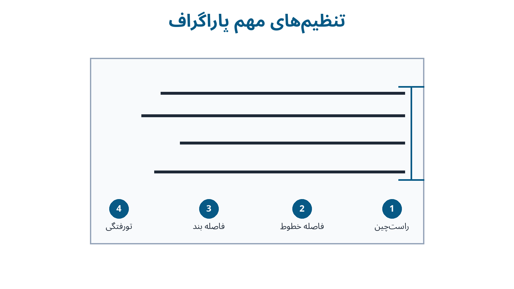

## هدف‌های یادگیری

می‌توانید تراز، فاصله خطوط، فاصله بندها و تورفتگی را تنظیم و فهرست نشانه‌دار یا شماره‌دار بسازید.

## آموزش مرحله‌به‌مرحله

۱. مکان‌نما را در بند قرار دهید یا چند بند را انتخاب کنید.  
۲. از **Home > Paragraph** تراز Right، Center، Left یا Justify را انتخاب کنید.  
۳. برای متن فارسی معمولاً Right یا Justify مناسب است.  
۴. از **Line and Paragraph Spacing** فاصله خطوط را روی 1.15 یا 1.5 قرار دهید.  
۵. در تنظیمات Paragraph، فاصله **Before/After** را تغییر دهید.  
۶. تورفتگی را با **Increase Indent/Decrease Indent** تنظیم کنید.  
۷. موارد هم‌ارز را با **Bullets** و مراحل ترتیبی را با **Numbering** نمایش دهید.  
۸. `Enter` بند تازه و `Shift+Enter` شکست سطر بدون بند تازه می‌سازد.

## تمرین هدایت‌شده

صفحه‌ای با عنوان وسط‌چین، یک بند دوطرفه با فاصله 1.5، فهرست نشانه‌دار چهارموردی و فهرست شماره‌دار سه‌مرحله‌ای بسازید.

## نکته

برای فاصله میان بندها چند بار Enter نزنید؛ از Spacing Before/After استفاده کنید.

## هشدار

برای وسط‌چین یا تورفتگی از Spaceهای پشت‌سرهم استفاده نکنید؛ صفحه با کوچک‌ترین تغییر به‌هم می‌ریزد.

## رفع اشکال

| مشکل | راه‌حل |
|---|---|
| همه سند وسط‌چین شد | فقط بندهای لازم را انتخاب و تراز را اصلاح کنید |
| شماره‌گذاری ادامه ندارد | Continue Numbering را انتخاب کنید |
| شماره از نو شروع نمی‌شود | Restart at 1 را اجرا کنید |
| فاصله بندها زیاد است | Before و After را بررسی کنید |

## چالش سه‌سطحی

- **پایه:** یک فهرست نشانه‌دار پنج‌موردی بسازید.
- **استاندارد:** مراحل انجام یک آزمایش را شماره‌گذاری کنید.
- **پیشرفته:** یک Multilevel List ساده ایجاد کنید.

**شاهد پوشه کار:** یک بند تنظیم‌شده و دو نوع فهرست.  
**پرسش خروج:** چه زمانی Numbering از Bullets مناسب‌تر است؟

---

# درس ۷: درج و تنظیم تصویر

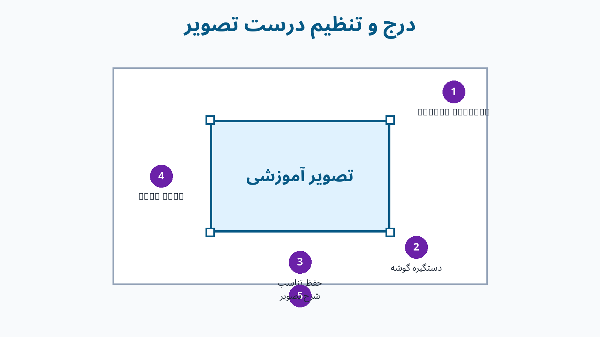

## هدف‌های یادگیری

می‌توانید تصویر را درج کنید، اندازه آن را بدون تغییر تناسب تنظیم کنید، آن را برش دهید و شیوه قرارگیری متن را تغییر دهید.

## آموزش مرحله‌به‌مرحله

۱. تصویر مناسب را در پوشه `تصاویر` ذخیره کنید.  
۲. مکان‌نما را در محل درج بگذارید.  
۳. از **Insert > Pictures > This Device** تصویر را انتخاب کنید.  
۴. برای تغییر اندازه، دستگیره گوشه تصویر را بکشید.  
۵. از **Picture Format > Wrap Text** یکی از حالت‌ها را انتخاب کنید:

- **In Line with Text:** تصویر مانند یک نویسه
- **Square:** متن پیرامون کادر
- **Top and Bottom:** متن فقط بالا و پایین تصویر

۶. با **Crop** بخش‌های اضافی را حذف کنید.  
۷. تصویر را وسط‌چین کنید.  
۸. زیر آن بنویسید: «شکل ۱ ـ محیط برنامه Word».

## تمرین هدایت‌شده

یک تصویر آموزشی درج کنید، آن را برش دهید، عرضش را حدود نصف صفحه قرار دهید، Wrap Text را روی Top and Bottom بگذارید و شرح یک‌خطی بنویسید.

## نکته

برای حفظ تناسب، تصویر را از گوشه تغییر اندازه دهید و بیش از اندازه بزرگ نکنید.

## هشدار

هر تصویر اینترنتی آزاد نیست. از تصویر خودتان، منبع مجاز یا فایل معرفی‌شده مدرس استفاده کنید.

## رفع اشکال

- تصویر جابه‌جا نمی‌شود: Wrap Text را بررسی کنید.
- تصویر کشیده شده است: Undo کنید و فقط دستگیره گوشه را بکشید.
- فایل بسیار حجیم است: Compress Pictures را با حفظ نسخه اصلی اجرا کنید.
- متن روی تصویر افتاده است: Top and Bottom را انتخاب کنید.

## چالش سه‌سطحی

- **پایه:** تصویر را درج و وسط‌چین کنید.
- **استاندارد:** تصویر را برش دهید و شرح بنویسید.
- **پیشرفته:** دو تصویر هم‌اندازه با تراز و فاصله منظم قرار دهید.

**شاهد پوشه کار:** فایل Word و تصویر اصلی.  
**پرسش خروج:** چرا In Line with Text برای شروع ساده‌تر است؟

---

# درس ۸: ساخت جدول

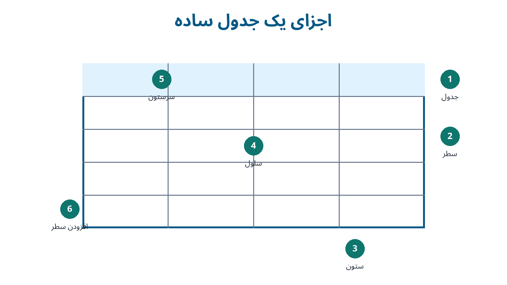

## هدف‌های یادگیری

می‌توانید جدول بسازید، داده وارد کنید، سطر و ستون را تغییر دهید و جدول را ساده و خوانا قالب‌بندی کنید.

## آموزش مرحله‌به‌مرحله

۱. از **Insert > Table** یک جدول ۴ ستون و ۵ سطر بسازید.  
۲. در سطر اول عنوان ستون‌ها را وارد کنید.  
۳. با `Tab` به سلول بعدی بروید.  
۴. از **Table Layout > Insert Above/Below/Left/Right** سطر یا ستون اضافه کنید.  
۵. برای حذف از **Table Layout > Delete** استفاده کنید.  
۶. برای عنوان سراسری، سلول‌های موردنظر را انتخاب و **Merge Cells** را اجرا کنید.  
۷. عرض ستون‌ها را با مرزها یا **AutoFit** تنظیم کنید.  
۸. در **Table Design** سبک ساده‌ای انتخاب کنید.  
۹. با **Borders** خطوط واقعی و با **Shading** زمینه محدود بسازید.  
۱۰. سطر عنوان را ضخیم و وسط‌چین کنید.

## تمرین هدایت‌شده

جدول برنامه هفتگی با ۵ ستون و ۶ سطر بسازید. سطر عنوان را متمایز، نوشته‌ها را وسط‌چین و عرض ستون‌ها را منظم کنید.

## نکته

فشردن `Tab` در آخرین سلول، یک سطر تازه می‌سازد.

## هشدار

جدول را با Space یا Tabهای پشت‌سرهم شبیه‌سازی نکنید.

## رفع اشکال

| مشکل | راه‌حل |
|---|---|
| جدول از صفحه بیرون رفته | AutoFit to Window را اجرا کنید |
| سطر ناخواسته اضافه شد | Undo یا Delete Row را اجرا کنید |
| متن در سلول جا نمی‌شود | عرض ستون یا اندازه متن را تنظیم کنید |
| خطوط چاپ نمی‌شوند | Borders واقعی را فعال کنید؛ Gridlines چاپ نمی‌شود |

## چالش سه‌سطحی

- **پایه:** جدول ۳×۴ بسازید.
- **استاندارد:** برنامه هفتگی کامل طراحی کنید.
- **پیشرفته:** عنوان سراسری جدول را با Merge Cells بسازید.

**شاهد پوشه کار:** جدول خام و نسخه قالب‌بندی‌شده.  
**پرسش خروج:** Gridlines و Borders چه تفاوتی دارند؟

---

# درس ۹: صفحه‌آرایی و شماره صفحه

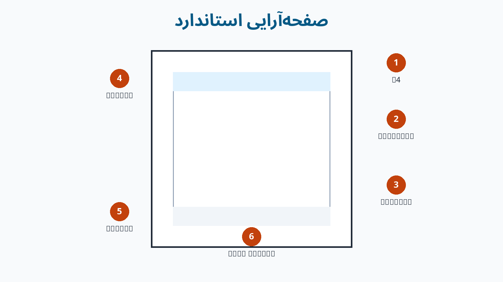

## هدف‌های یادگیری

می‌توانید اندازه، جهت و حاشیه صفحه را تنظیم کنید، Page Break بسازید و Header، Footer و Page Number درج کنید.

## آموزش مرحله‌به‌مرحله

۱. از **Layout > Size** اندازه A4 را انتخاب کنید.  
۲. در **Layout > Orientation** حالت Portrait یا Landscape را تعیین کنید.  
۳. از **Layout > Margins** حاشیه Normal را انتخاب کنید.  
۴. برای صفحه تازه `Ctrl+Enter` یا **Insert > Page Break** را اجرا کنید.  
۵. از **Insert > Header** سربرگ ساده‌ای با نام درس بسازید.  
۶. از **Insert > Footer** نام دانش‌آموز را در پابرگ بنویسید.  
۷. از **Insert > Page Number** شماره را در پایین صفحه قرار دهید.  
۸. برای نبودن شماره روی صفحه اول، **Different First Page** را فعال کنید.  
۹. با **Close Header and Footer** به متن اصلی بازگردید.

## تمرین هدایت‌شده

یک سند دوصفحه‌ای A4 و Portrait با Margins عادی، سربرگ نام درس، پابرگ نام دانش‌آموز و شماره صفحه بسازید.

## نکته

برای صفحه تازه چند بار Enter نزنید؛ همیشه Page Break را به‌کار ببرید.

## هشدار

تغییر Orientation معمولاً کل بخش جاری را تغییر می‌دهد. جهت متفاوت در یک صفحه به Section Break نیاز دارد و خارج از این درس است.

## رفع اشکال

- Header کم‌رنگ دیده می‌شود: طبیعی است و در چاپ عادی ظاهر می‌شود.
- صفحه خالی ناخواسته است: `Ctrl+Shift+8` را بزنید و Page Break یا بندهای اضافی را بررسی کنید.
- شماره تکرار نمی‌شود: آن را با Page Number در Header یا Footer درج کنید.
- همه متن به صفحه دوم رفت: Page Break اشتباه را حذف کنید.

## چالش سه‌سطحی

- **پایه:** شماره صفحه درج کنید.
- **استاندارد:** سند دوصفحه‌ای با Header و Footer بسازید.
- **پیشرفته:** صفحه اول را بدون شماره نمایشی تنظیم کنید.

**شاهد پوشه کار:** فایل دوصفحه‌ای کامل.  
**پرسش خروج:** چرا Page Break از Enterهای متعدد بهتر است؟

---

# درس ۱۰: چاپ و خروجی PDF

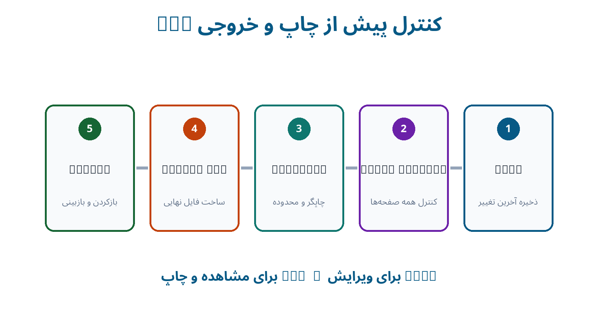

## هدف‌های یادگیری

می‌توانید پیش‌نمایش چاپ را بررسی کنید، محدوده چاپ را تنظیم کنید، سند را به PDF تبدیل و فایل‌های نهایی را درست تحویل دهید.

## آموزش مرحله‌به‌مرحله

۱. سند را با `Ctrl+S` ذخیره کنید.  
۲. با **File > Print** یا `Ctrl+P` وارد Print Preview شوید.  
۳. تعداد صفحات، حاشیه، تصویر، جدول، شماره صفحه و صفحه خالی را بررسی کنید.  
۴. Printer درست، Copies و Page Range را کنترل کنید.  
۵. بدون اجازه مدرس فرمان نهایی Print را اجرا نکنید.  
۶. برای PDF از **File > Export > Create PDF/XPS** یا **File > Save As > PDF** استفاده کنید.  
۷. فایل‌ها را با نام‌های زیر ذخیره کنید:

- `پروژه-Word-نام‌خانوادگی.docx`
- `پروژه-Word-نام‌خانوادگی.pdf`

۸. PDF را باز و صفحه‌به‌صفحه کنترل کنید.

## تمرین هدایت‌شده

یک سند دوصفحه‌ای دارای سه خطای ظاهری را بررسی کنید، خطاها را اصلاح و خروجی PDF تهیه کنید.

## نکته

PDF ظاهر سند را برای مشاهده و چاپ حفظ می‌کند، اما DOCX برای ادامه ویرایش لازم است.

## هشدار

پیش از چاپ، نام چاپگر و تعداد نسخه را کنترل کنید تا کاغذ و جوهر هدر نرود.

## رفع اشکال

| مشکل | راه‌حل |
|---|---|
| PDF نسخه قدیمی است | DOCX را ذخیره و PDF را دوباره بسازید |
| جدول در PDF بریده شده | عرض جدول و حاشیه‌ها را اصلاح کنید |
| صفحه سفید دیده می‌شود | Page Break و بندهای خالی را بررسی کنید |
| PDF پیدا نمی‌شود | محل انتخاب‌شده در Save As را بررسی کنید |

## چالش سه‌سطحی

- **پایه:** از یک صفحه PDF بسازید.
- **استاندارد:** سند دوصفحه‌ای را در DOCX و PDF تحویل دهید.
- **پیشرفته:** فقط صفحات مشخصی را خروجی بگیرید و تفاوت را توضیح دهید.

**شاهد پوشه کار:** DOCX، PDF و چک‌لیست کنترل چاپ.  
**پرسش خروج:** چرا نگهداری هر دو فایل DOCX و PDF لازم است؟

---

# پروژه پایانی: بازسازی بخشی از کتاب درسی

## مأموریت

دو صفحه پیوسته از یک بخش مناسب کتاب درسی را در Word بازسازی کنید. نمونه بهتر است شامل عنوان، چند بند، تصویر و یک جدول یا فهرست ساده باشد. خروجی فقط برای فعالیت آموزشی کلاس استفاده می‌شود.

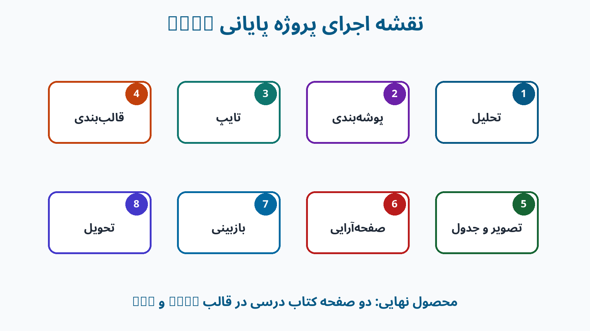

## مراحل پروژه

۱. **تحلیل نمونه:** عنوان‌ها، بندها، تصویر، جدول، حاشیه و شماره صفحه را علامت بزنید.  
۲. **ساخت پوشه:** پوشه‌های منابع، تصاویر، نسخه‌های کاری و تحویل نهایی را ایجاد کنید.  
۳. **ایجاد سند:** A4، جهت، حاشیه و نام فایل را تنظیم کنید.  
۴. **ورود متن:** فارسی و انگلیسی، جهت، نیم‌فاصله و نشانه‌گذاری را بررسی کنید.  
۵. **قالب‌بندی:** عنوان‌ها، متن، بندها و فهرست‌ها را هماهنگ کنید.  
۶. **تصویر و جدول:** اندازه، Wrap Text، شرح، سطر، ستون و Borders را تنظیم کنید.  
۷. **صفحه‌آرایی:** صفحه دوم را با Page Break، سپس Header/Footer و شماره صفحه بسازید.  
۸. **کنترل:** Print Preview را ببینید و خطاهای صفحه را اصلاح کنید.  
۹. **خروجی:** DOCX و PDF نهایی را تولید کنید.  
۱۰. **ارائه:** یک تصمیم خوب و یک خطای اصلاح‌شده را برای کلاس توضیح دهید.

## فایل‌های تحویلی

1. `پروژه-نهایی-نام‌خانوادگی.docx`
2. `پروژه-نهایی-نام‌خانوادگی.pdf`
3. تصویر یا فایل مرجع در صورت اجازه مدرس
4. فرم خودارزیابی
5. پوشه تصاویر استفاده‌شده

---

# چک‌لیست پروژه

برای هر مورد «انجام شد»، «نیاز به اصلاح» یا «نامربوط» را علامت بزنید.

- [ ] فایل در پوشه درست و با نام استاندارد ذخیره شده است.
- [ ] سند دقیقاً دو صفحه دارد.
- [ ] اندازه، جهت و حاشیه مناسب است.
- [ ] عنوان اصلی و عنوان‌های فرعی مشخص‌اند.
- [ ] قالب عنوان‌های هم‌سطح یکسان است.
- [ ] فارسی راست‌به‌چپ و انگلیسی درست نمایش داده می‌شود.
- [ ] نیم‌فاصله و نشانه‌گذاری بررسی شده است.
- [ ] بین واژه‌ها فاصله اضافی نیست.
- [ ] تراز و فاصله خطوط مناسب است.
- [ ] صفحه دوم با Page Break ساخته شده است.
- [ ] فهرست‌ها با Bullets یا Numbering ساخته شده‌اند.
- [ ] تصویرها متناسب و داخل محدوده صفحه‌اند.
- [ ] تصویرها کشیده یا فشرده نشده‌اند.
- [ ] شرح تصاویر خوانا و هماهنگ است.
- [ ] جدول از صفحه بیرون نرفته است.
- [ ] Borders لازم در جدول فعال است.
- [ ] Header، Footer و Page Number درست‌اند.
- [ ] صفحه خالی ناخواسته وجود ندارد.
- [ ] Print Preview بررسی شده است.
- [ ] PDF با آخرین DOCX هماهنگ است.
- [ ] هر دو فایل تحویل داده شده‌اند.

---

# روبریک ارزشیابی پروژه

| معیار | ۴ ـ فراتر از انتظار | ۳ ـ مطابق انتظار | ۲ ـ در حال یادگیری | ۱ ـ نیازمند آموزش |
|---|---|---|---|---|
| مدیریت فایل | نام‌گذاری، پوشه‌بندی، DOCX و PDF کاملاً منظم | فایل‌ها درست و قابل شناسایی | یک فایل یا بخشی از پوشه ناقص | فایل گم یا تحویل‌نشده |
| تایپ و ویرایش | دقیق، روان و دارای نیم‌فاصله درست | چند خطای جزئی | خطاهای تکراری دارد | خطاها خواندن را دشوار کرده |
| قالب متن و بند | سلسله‌مراتب کاملاً هماهنگ و خوانا | بیشتر قالب‌ها درست | ناهماهنگی مشخص دارد | شلوغ یا نامنظم است |
| تصویر، فهرست و جدول | همه عناصر دقیق و هدفمند | عناصر اصلی درست‌اند | بعضی عناصر ناقص‌اند | عناصر اصلی وجود ندارند |
| صفحه‌آرایی | متعادل، بدون بریدگی و شماره‌گذاری درست | تقریباً بدون خطاست | شکست صفحه یا حاشیه مشکل دارد | ساختار صفحات نامناسب است |
| بازبینی | جزئیات دقیق و خطاها اصلاح شده‌اند | ظاهر کلی مشابه نمونه | فقط بخش‌هایی مشابه است | پروژه ناقص است |

**امتیاز کل:** ۲۴  
۲۱ تا ۲۴: تسلط بسیار خوب | ۱۷ تا ۲۰: تسلط مورد انتظار | ۱۲ تا ۱۶: تمرین بیشتر | ۶ تا ۱۱: آموزش دوباره

---

# خودارزیابی دانش‌آموز

برای هر عبارت یکی از گزینه‌های «می‌توانم»، «با کمک می‌توانم» یا «باید تمرین کنم» را انتخاب کنید.

| مهارت | می‌توانم | با کمک | باید تمرین کنم |
|---|:---:|:---:|:---:|
| ساخت، ذخیره و بازکردن فایل | □ | □ | □ |
| نام‌گذاری و پوشه‌بندی | □ | □ | □ |
| تایپ فارسی و انگلیسی | □ | □ | □ |
| نیم‌فاصله و نشانه‌گذاری | □ | □ | □ |
| انتخاب، کپی و جابه‌جایی متن | □ | □ | □ |
| قالب‌بندی هماهنگ | □ | □ | □ |
| تنظیم پاراگراف و فهرست | □ | □ | □ |
| درج و تنظیم تصویر | □ | □ | □ |
| ساخت جدول | □ | □ | □ |
| صفحه‌آرایی و شماره صفحه | □ | □ | □ |
| Print Preview و PDF | □ | □ | □ |

## بازتاب کوتاه

- بهترین بخش پروژه من:
- دشوارترین بخش:
- خطایی که پیدا و اصلاح کردم:
- مهارتی که باید بیشتر تمرین کنم:
- اگر دوباره پروژه را بسازم، چه چیزی را تغییر می‌دهم؟

---

# آزمون عملکردی

## موقعیت

مدرس فایل خامی شامل متن، تصویر و اطلاعات یک جدول در اختیار شما می‌گذارد. آن را به یک سند دوصفحه‌ای منظم تبدیل کنید.

## وظایف و امتیاز

| وظیفه | امتیاز |
|---|---:|
| ذخیره با نام استاندارد | ۲ |
| قالب‌بندی عنوان اصلی و دو عنوان فرعی | ۲ |
| اصلاح جهت، نیم‌فاصله و سه خطای نگارشی | ۳ |
| تنظیم بند و فاصله خطوط | ۲ |
| ساخت فهرست شماره‌دار | ۲ |
| درج و تنظیم تصویر و شرح | ۲ |
| ساخت و قالب‌بندی جدول | ۲ |
| ایجاد صفحه دوم با Page Break | ۱ |
| درج Header و Page Number | ۱ |
| کنترل و ساخت PDF | ۲ |
| تحویل DOCX و PDF | ۱ |
| **جمع** | **۲۰** |

## قواعد

- راهنمای کوتاه میان‌برها مجاز است.
- دریافت فایل آماده از دانش‌آموز دیگر مجاز نیست.
- پرسش درباره محل فرمان مجاز است، اما مدرس کار را به‌جای دانش‌آموز انجام نمی‌دهد.
- کیفیت و درستی مهم‌تر از شباهت کامل به نمونه است.

---

# راهنمای کوتاه مدرس

## الگوی اجرای هر واحد

۱. نمایش محصول نهایی  
۲. آموزش کوتاه فرمان‌ها  
۳. تمرین هدایت‌شده هم‌زمان  
۴. چالش انتخابی  
۵. ذخیره شاهد پوشه کار و پرسش خروج

## اصول تدریس

- ابتدا محصول را نشان دهید و سپس فرمان‌ها را آموزش دهید.
- هر توضیح مدرس باید به یک اقدام دانش‌آموز وصل شود.
- آموزش مستقیم پیوسته را کوتاه نگه دارید.
- دانش‌آموز سریع‌تر می‌تواند راهنما باشد، اما نباید ماوس دوستش را در دست بگیرد.
- از فایل خام مشترک استفاده کنید تا زمان کلاس صرف تایپ طولانی نشود.
- نام‌گذاری و ذخیره فایل در همه درس‌ها ارزیابی شود.
- بازخورد دقیق بدهید: «تصویر از حاشیه بیرون رفته؛ عرض را کم و Print Preview را دوباره بررسی کن.»

## تفاوت‌های نسخه

- فرمان‌های اصلی Word 2021 و Microsoft 365 تقریباً یکسان‌اند.
- ظاهر صفحه آغاز یا محل گزینه‌های فرعی ممکن است متفاوت باشد.
- در رابط فارسی، ترجمه فرمان‌ها ممکن است کمی تفاوت داشته باشد؛ نام انگلیسی معیار جست‌وجو است.
- AutoSave معمولاً برای فایل OneDrive فعال است؛ برای فایل محلی همچنان `Ctrl+S` لازم است.

## ایمنی و اخلاق

- اطلاعات شخصی در تمرین‌ها نوشته نشود.
- منبع و مجوز تصویر رعایت شود.
- پیش از چاپ، چاپگر، تعداد نسخه و محدوده صفحات کنترل شود.
- علاوه بر PDF، فایل قابل‌ویرایش DOCX نگهداری شود.

---

# برگه میان‌برهای ضروری

| عمل | میان‌بر | عمل | میان‌بر |
|---|---|---|---|
| سند جدید | `Ctrl+N` | بازکردن | `Ctrl+O` |
| ذخیره | `Ctrl+S` | چاپ | `Ctrl+P` |
| انتخاب همه | `Ctrl+A` | جست‌وجو | `Ctrl+F` |
| جایگزینی | `Ctrl+H` | کپی | `Ctrl+C` |
| برش | `Ctrl+X` | چسباندن | `Ctrl+V` |
| بازگردانی | `Ctrl+Z` | انجام دوباره | `Ctrl+Y` |
| ضخیم | `Ctrl+B` | زیرخط | `Ctrl+U` |
| صفحه تازه | `Ctrl+Enter` | نمایش نشانه‌ها | `Ctrl+Shift+8` |
| تغییر زبان | `Windows+Space` | نمایش Ribbon | `Ctrl+F1` |

---

# فایل‌های همراه

- فایل تمرین خام برای آزمون عملکردی
- نمونه پاسخ پروژه دوصفحه‌ای
- نسخه PDF نمونه پاسخ
- تصاویر شماتیک شماره‌گذاری‌شده
- فرم خودارزیابی و روبریک داخل همین جزوه

این نسخه برای اجرای آزمایشی Word پایه هفتم تهیه شده است. بازخورد دانش‌آموزان و مدرس، مبنای ویرایش بعدی و تولید جلدهای پایه هشتم و نهم خواهد بود.

